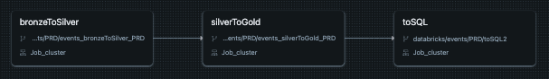

# Factored Datathon 2024 - LatamFusion

## Table of Contents 
- [Description](#description)
- [Features](#features)
- [Project Structure](#project-structure)
- [Architecture](#architecture)
- [Data Pipeline](#data-pipeline)
- [Data Engineering](#data-engineering)
- [Machine Learning Models](#machine-learning-models)
- [Deployment](#deployment)
- [Visualizations](#visualizations)
- [About Us](#about-us)

## Description 

This project leverages the GDELT Project Dataset to generate critical insights that empower stakeholders to make data-driven decisions. Our web-based application enables users to monitor the current and projected situations of various countries, aiding in strategic planning and providing early warnings for potential risks. The solution is driven by AI, focusing on the analysis of two key indicators extracted from the GDELT dataset: Tone and GoldsteinScale. These metrics, when combined, offer a comprehensive view of a country's social, political, and economic stability as reflected in global news coverage, making them essential for evaluating regional stability and identifying areas of concern.

## Features 

- **Historical and Real-Time Data Visualization:** Explore and analyze time-series data from key indicators.
- **Indicator Evolution Forecasting:** Predict future trends of important indicators to anticipate potential risks and opportunities.
- **Automated Alerts:** Receive notifications when indicators surpass predefined thresholds, enabling proactive decision-making.
- **Insight Summarization:** Obtain concise summaries of significant insights drawn from global news coverage.
- **Interactive World Map:** Visualize insights across different regions with a comprehensive world map for an enhanced analytical experience.

## Project Structure

The project is structured to streamline data processing, machine learning, and deployment. It begins with the collection and ingestion of data, where scripts manage the streaming of real-time information and batch downloads from Azure Data Lake. Data is then processed and analyzed using Databricks, which handles both GKG and Events datasets through various stages of processing, feature engineering, and model training. Exploratory data analysis is performed to understand data characteristics before applying machine learning techniques. The final solution is deployed as a web application, which visualizes the processed data and model predictions, offering interactive features and insights. Supporting documentation and visualizations are maintained to enhance the project's clarity and communication.

## Architecture

## Data Pipeline

Data pipelines were developed using Databricks Workflows as shown in the images:

Our data pipeline processes and manages data from the GDELT Project. It includes several key stages:

#### 1. **Data Ingestion**

- **Streaming Data:** 
  - **Tool:** Azure Functions
  - **Description:** Continuously collects real-time data.

- **Batch Data:**
  - **Tool:** Custom Crawlers
  - **Description:** Periodically retrieves data from Azure Data Lake.

#### 2. **Data Transformation**

Data is transformed in Azure Databricks through three layers:

- **Bronze Layer:** 
  - **Purpose:** Initial data ingestion and basic cleaning.

- **Silver Layer:** 
  - **Purpose:** Refine data and extract key features.

- **Gold Layer:** 
  - **Purpose:** Final data processing and feature engineering for model use.

#### 3. **Feature Engineering**

New features are created to improve model predictions:

- **Temporal Features:** Extracted from date and time.
- **Lag Features:** Capture past data points.
- **Cyclical Features:** Handle repeating patterns.
- **Rolling Window Features:** Smooth data trends.

#### 4. **Machine Learning**

- **Models:** RandomForestRegressor for predicting Tone and GoldsteinScale.
- **Optimization:** GridSearch is used to fine-tune models.

#### 5. **Deployment**

- **Tool:** Streamlit
- **Description:** Deploys the solution as a web application for user interaction and alerts.

## Data Engineering

Our data pipeline is designed to handle large volumes of streaming and batch data from the GDELT Project. We use Azure Functions for real-time data ingestion, while batch data is periodically retrieved using custom crawlers. The raw data undergoes several transformation stages within Azure Databricks:

- **Bronze Layer:** Initial raw data ingestion and basic cleaning.
- **Silver Layer:** Further data refinement and feature extraction, making the data ready for analysis.
- **Gold Layer:** Final data processing steps, including advanced feature engineering and aggregation, to create the datasets used by our machine learning models.

The processed data is stored in Azure Data Lake, ensuring high availability and scalability.

## Machine Learning Models

We developed two **RandomForestRegressor** models, each optimized with GridSearch for hyperparameter tuning:

- **Tone Prediction Model:** Forecasts the Tone indicator, reflecting the overall sentiment in the news coverage related to a country.
- **GoldsteinScale Prediction Model:** Predicts the GoldsteinScale, which indicates the stability or instability of a country.

#### Model Pipeline

1. **Feature Engineering:** Includes transformations such as lag features, rolling windows, and one-hot encoding of categorical variables.
2. **Model Training:** The models are trained using GridSearchCV to ensure robust performance over unseen data.
3. **Threshold-Based Alerts:** When the predicted values exceed predefined thresholds, alert dates are generated and displayed in the web application.

## Deployment

Take a look at the latest version of our product here: [LatamFusion App](https://latamfusionapp.azurewebsites.net/)

## Visualizations

### Prediction Plot

### GoldsteinScale Map

## About Us

Our team is composed of 4 members with different backgrounds and experiences. We are all passionate about data science and we are excited to share our findings with you. The name *LatamFusion* comes from the fact that we are all from different countries in Latin America and we are fusing our knowledge to create a great solution.

The team members are:

- [Hugo Vallejo](https://www.linkedin.com/in/hugo-r-vallejo-angulo/): Based in São Paulo, Brazil, and originally from Caracas, Venezuela. Hugo is a PhD candidate in Artificial Intelligence at Universidade de São Paulo. Currently working as a Data Engineer, Hugo contributed to the project by setting up the data pipeline and the ML model.

- [Agustín Rodríguez](https://www.linkedin.com/in/agustinnrodriguez/): Based in Buenos Aires, Argentina, and originally from the same city. Agustín is a Data Science & AI Enthusiast, currently working as a Backend Developer. He contributed to the project by defining the business goal, exploring the data, and developing analytics and ML solutions.

- [César Arroyo](https://www.linkedin.com/in/cesar-arroyo-cardenas): Based in Ciudad de México, México, and originally from Cartagena, Colombia. César has worked as a Data Scientist and BI Developer. Currently working as a Data Scientist, he contributed to the project by automating processes and setting up the web application.

- [Jesús Castillo](https://www.linkedin.com/in/jes%C3%BAs-castillo/): Based on La Serena, Chile, and originally from the same city. Jesús is a Data Scientist. He comes from a background as a translator and interpreter. He is currently looking forward to expand his knowledge in the field of data science, particularly in LLMs, he contributed to the project by setting the time series model and improved it by hyperparameters optimization.

